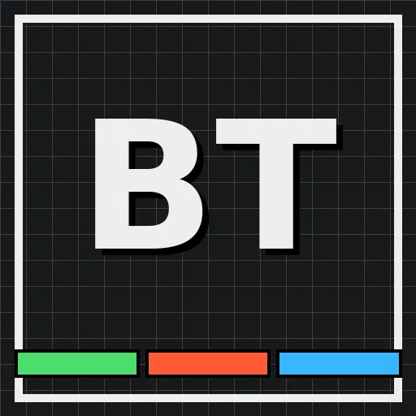

[README.md](https://github.com/user-attachments/files/32159068/README.md)
<p align="center">
  
</p>

<h1 align="center">BT Terminal</h1>

<p align="center">
  A retro pixel-console progress tracker for JEE-style exam prep — Maths, Physics &amp; Chemistry, module by module, exercise by exercise.
</p>

<p align="center">
  
  
  
  
</p>

---

## ⚡ What is this?

**BT Terminal** is a single-page, no-build-step study dashboard styled like a retro terminal/arcade console (pixel fonts, scanline grid, chunky drop-shadow buttons). Everything runs client-side in the browser and everything you track is saved to `localStorage` — no backend, no account, no sign-up.

It's built around one idea: **open the app, see exactly where you stand, log a solved exercise in two clicks, close the app.**

## 🧩 Features

- **📚 Subject → Module → Chapter drill-down** for Maths, Physics, and Chemistry, with progress bars and completion stats at every level
- **✅ Exercise tracking** — log solved counts for EX-1 / EX-2 per chapter against known totals
- **🎯 PYQ (Previous Year Questions) tracking** alongside regular exercises
- **📌 "Today's Focus"** — pin a chapter to the dashboard with quick `+1` buttons and an undo stack
- **🔥 Heatmap view** — a GitHub-style activity heatmap per subject to visualize consistency
- **📅 Calendar & countdowns** — track key dates and see live countdowns to exams/deadlines
- **🕐 Live IST clock** on the dashboard
- **🔁 Revision mode & freeze days** for spaced review and planned breaks
- **⏱️ Pomodoro stats** tracking for focused study sessions
- **💾 Export/backup reminders** — nudges you to export your progress if it's been a while
- **🎨 Distinct color themes** per subject (green/orange/blue) for fast visual scanning

## 🚀 Getting started

No installation, no dependencies, no build tools.

```bash
git clone https://github.com/<your-username>/bt-terminal.git
cd bt-terminal
```

Then just open `BT_Terminal.html` directly in a browser — or serve it locally:

```bash
python3 -m http.server 8000
# visit http://localhost:8000/BT_Terminal.html
```

## 🗂️ Project structure

```
bt-terminal/
├── BT_Terminal.html   # the entire app: markup, styles, and logic in one file
└── logo.jpg           # app icon / favicon
```

## 💽 Data & privacy

All progress (exercises, PYQs, countdowns, pins, heatmap history, Pomodoro stats) is stored **only in your browser's `localStorage`**. Nothing is sent to a server. Clearing browser data or switching browsers/devices will lose your progress unless you use the export feature — so back up regularly using the in-app **EXPORT NOW** prompt.

## 🛠️ Tech stack

- Vanilla JavaScript (no framework, no bundler)
- `VT323` and `Press Start 2P` (Google Fonts) for the terminal/pixel aesthetic
- CSS custom properties for the subject-specific color themes
- Browser `localStorage` for persistence

## 🤝 Contributing

Issues and pull requests are welcome — since it's a single HTML file, most changes are a straightforward diff. Please keep the no-build-step philosophy intact.

## 📄 License

Add your preferred license here (e.g. MIT).
